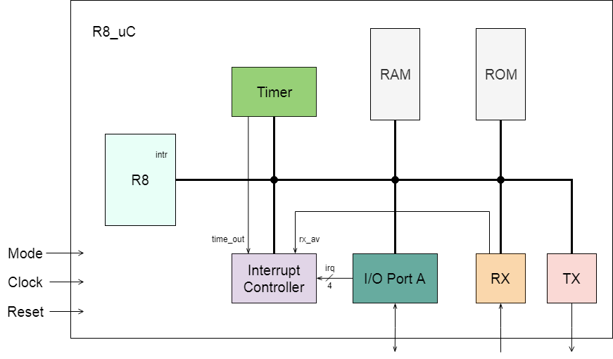
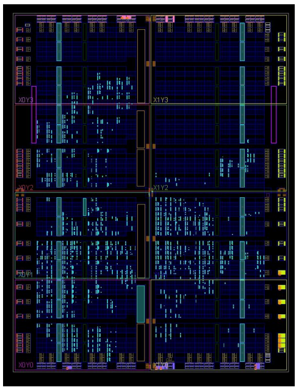

# R8-core_FPGA_microcontroller

Microcontroller implementation using an expanded version of the R8 ISA (PUCRS), aiming FPGA synthesis.
Coursework for ELC1094 - Projeto de Processadores, Universidade Federal de Santa Maria, jan/2019.
  

High-level schematic of the microcontroller
 

  

Logic and memory utilization when synthesized to the Spartan 6 CSG324 FPGA.
 

  

